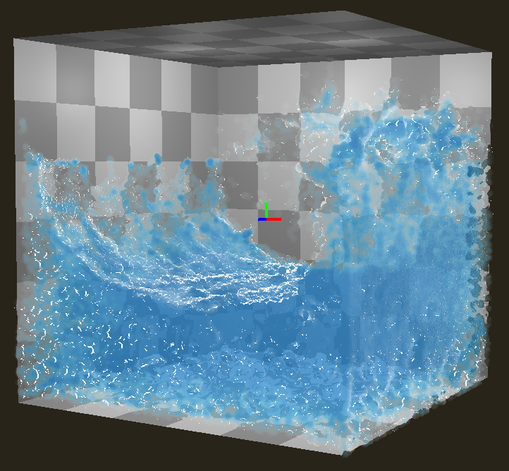

# gl-pic-fluid

*Realtime 3D particle-in-cell fluid simulation*

Based on Robert Bridson's *Fluid Simulation for Computer Graphics, 2nd ed.*

Implements NVidia's ["Screen Space Fluid Rendering for Games"](http://developer.download.nvidia.com/presentations/2010/gdc/Direct3D_Effects.pdf).

[Video Demo](https://www.youtube.com/watch?v=lNG8B_eWKaw)

## Requirements

* OpenGL >= 4.3
* cmake >= 3.10
* C++ compiler for version >= 17

## Building

1. `git submodule update --init --recursive`
2. `mkdir build`
3. `cd build`
4. `cmake ..`
5. Use generated build system

## Running

1. `cd build`
2. `bin/fluid`

Controls:
* Left click and drag to interact with fluid
* Right click and drag to rotate the view
* `space` - play/pause
* `s` - step
* `r` - reset
* `f` - toggle screen space fluid rendering
* `p` - toggle particle visibility (for viewing grid)
* PIC/FLIP blending controls
    * `home` - set FLIP 0.9
    * `end` - set FLIP 0.0 (PIC)
    * `page up` - increase FLIP
    * `page down` - decrease FLIP
* Grid visualization controls
    * `g` - toggle grid visualization
    * `1` - cell type
    * `2` - velocity
    * `3` - divergence
    * `4` - pressure solver A coefficients
    * `5` - pressure

## Known Bugs

* There is a lingering boundary condition bug which causes fluid to stick to positive direction walls.
    * The stickiness is patched in the pressure update shader, but a bias in the fluid pressures remains.
* If fluid gathers in the +XYZ corner of the cube, it can cause the simulation to explode. I expect that this is related to or is a result of the previous bug.
    * Press `r` to restart the simulation if this happens

## Development

* Simulation code is split across `src/Fluid.hpp` and `*.cs.glsl` shaders in `shader/`
* Make sure to list new source files in CMakeLists.txt!
