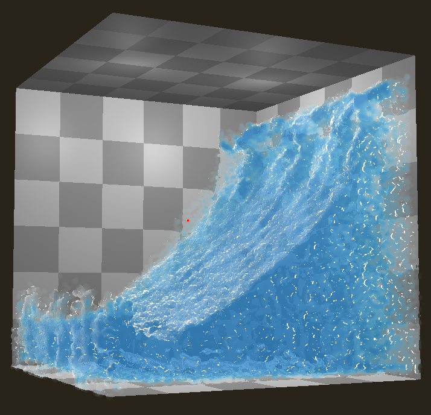

# gl-pic-fluid

*Realtime 3D particle-in-cell fluid simulation*

## Requirements

* OpenGL >= 4.3
* cmake >= 3.10
* C++ compiler for version >= 17

## Building

1. `mkdir build`
2. `cd build`
3. `cmake ..`
4. Use generated build system

## Running

1. `cd build`
2. `bin/fluid`

Controls:
* `space` - play/pause
* `s` - step
* `r` - reset
* `f` - toggle screen space fluid rendering
* `p` - toggle particle visibility (for viewing grid)
* PIC/FLIP blending controls
    * `home` - set FLIP 0.9
    * `end` - set FLIP 0.0 (PIC)
    * `page up` - increase FLIP
    * `page down` - decrease FLIP
* Grid visualization controls
    * `g` - toggle grid visualization
    * `1` - cell type
    * `2` - velocity
    * `3` - divergence
    * `4` - pressure solver A coefficients
    * `5` - pressure

## Development

* Make sure to list new source files in CMakeLists.txt!
* Simulation code is split across `src/Fluid.hpp` and `*.cs.glsl` shaders in `shader/`
